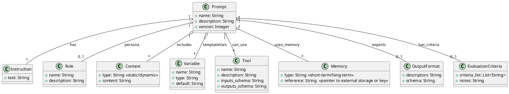

# General-Purpose Prompt Engineering System: Domain and Architecture Model

## Domain Model of a Prompt

A **Prompt** in this system is treated as a structured object (or template) that encapsulates all information needed to query an LLM. It is **parameterized** and made of several key components that can be reused and configured. The prompt is essentially a composition of instructions, context, and metadata that tells the LLM *what* to do and *how* to do it.

* **Prompt**: The top-level entity representing a complete input query or template for the LLM. A prompt may include text and metadata. It serves as a container for all other elements (roles, instructions, etc.) and can be instantiated with different variable values. Treating prompts as first-class objects means they can have versions, metadata, and be stored/reused like code artifacts.

* **Instruction**: The main task or directive given to the LLM. This is typically a clear natural-language command or question that specifies the job to perform (e.g. “*Summarize the following text...*”). It is the core of the prompt that *tells the AI exactly what task it should perform* [learnprompting.org](learnprompting.org). A well-defined instruction reduces ambiguity and ensures the model knows what output is expected.

* **Role**: An optional persona or identity assigned to the LLM to influence its style or knowledge domain. By specifying a role (often via a system message like “*You are a helpful travel agent*”), the prompt frames the context in which the AI should respond. The role component *assigns a specific persona or perspective to the AI, encouraging it to tailor its response according to the designated role* [learnprompting.org](learnprompting.org). This can guide tone and expertise (for example, an “Expert Doctor” role vs. a “Friendly Tutor” role yields different styles of answers).

* **Context**: Background information or data provided to ground the prompt. Context can be **static** or **dynamic**:

  * *Static context* is fixed, pre-defined information that remains constant (for example, a passage of reference text, documentation, or a persistent system instruction). It’s provided at design time to give the model necessary knowledge or constraints.

  * *Dynamic context* is injected at runtime, often fetched or updated based on the current situation or user input. This could include recent conversation history, retrieved documents, or other real-time data. In practice, *static context will sometimes suffice by giving the model all necessary info upfront, but in other cases you need to pass dynamic context (e.g. retrieved facts) especially when dealing with context length limits* [vellum.ai](vellum.ai). The prompt may combine both types – for instance, a static company policy plus dynamic details looked up for the user’s query.

* **Variables**: Placeholders within the prompt that get filled in with actual values when the prompt is used. These allow the prompt template to be parameterized and reused. Each variable can have a **type** (e.g. string, number, list) and an optional default. For example, a prompt template might have a variable `{customer_name}` of type string. At runtime, this is replaced with the actual customer’s name. Defining variable types/defaults helps with input validation and documenting what data is expected. It also allows programmatic construction of prompts by supplying a dictionary of variable values. (For instance, a template “*Hello {name}, how can I help you?*” has a variable `name` that must be provided.)

* **Tools**: References to external functions or actions the LLM can invoke as part of the prompt (this is often called **function calling** or plugin use). Tools are defined with an API (name, inputs/outputs) and a description. They are made available to the model either through special syntax or via the system’s function-calling interface. In the prompt domain model, **a Tool** entity represents an operation the model can call (e.g. a calculator, web search, database query). The prompt (especially in an agent context) may include a list or description of available tools and how to invoke them. For instance, in OpenAI function calling, the developer provides the function schema to the model alongside the prompt [promptingguide.ai](promptingguide.ai). Enabling tools means the model can output a structured *action* (like a JSON indicating a function call), which the system will execute. This allows the prompt to go beyond pure text and interact with external systems.

* **Memory**: An interface to past information that the prompt can leverage. We distinguish:

  * **Short-term memory**: recent interaction history or transient context that fits in the prompt’s context window. For example, in a chat, this includes the last few user and assistant messages. It provides continuity so the model remembers what has been said recently. It’s typically included as part of the prompt (e.g., concatenating a transcript of recent dialogue). Short-term memory *is realized by in-context learning within the prompt and is limited by the context window size* [promptingguide.ai](promptingguide.ai).

  * **Long-term memory**: information from earlier interactions or background knowledge that is too large to always fit in the prompt. This is stored outside the prompt (e.g. in a database or vector store) and retrieved as needed. For example, a user’s profile or entire conversation history could be long-term memory. When relevant, the system fetches pertinent pieces (through search or embeddings) and injects them into the prompt as dynamic context. Long-term memory often uses a retrieval mechanism to supply the LLM with needed details on demand [promptingguide.ai](promptingguide.ai) (for instance, fetching a knowledge snippet based on the current query). The domain model may treat Memory as a component associated with a prompt – the prompt template can specify what memories to retrieve or how to incorporate memory (like a placeholder for “<conversation_history>”). In advanced cases, *hybrid memory* combines both types, where the prompt carries recent info and the system references external memory for older knowledge.

* **Output Format**: A specification of the structure or format the LLM’s answer should follow. Many prompts include instructions like “*Answer in JSON*” or “*Provide a bulleted list*” to constrain the output. In the domain model, **OutputFormat** represents the expected format/schema of the LLM response. This could be a simple format description (e.g. “paragraph of text” vs “JSON with fields name and age”) or a rigorous schema (a JSON schema or Pydantic model defining the output). Specifying an output format helps in post-processing the result reliably. For instance, a prompt might say: “*Provide the answer as a JSON object with keys `answer` and `source`.*” Some systems allow defining an output model that the LLM should conform to, enabling automatic validation [docs.ragas.io](docs.ragas.io). By treating output format as part of the prompt definition, we ensure the LLM knows the required answer shape and the system knows how to interpret the result.

* **Evaluation Criteria**: Criteria or metrics to assess the quality of the LLM’s output for this prompt. This entity defines what a “good” answer looks like. Criteria might include correctness, completeness, relevance to the query, factual accuracy, tone adherence, etc., depending on the task. These can be used in two ways: (1) as part of the prompt itself (e.g., a self-check instruction: “*Make sure the answer is polite and contains at least 3 key points.*”), and/or (2) externally, by the system’s evaluator to score or verify the output. **EvaluationCriteria** often come into play during prompt development and refinement – they let us systematically test if a prompt’s outputs meet the requirements. For example, you might define criteria that the summary “should not exceed 100 words and must mention the protagonist’s name,” and then evaluate outputs against this. In a prompt management system, criteria and prompts are versioned together for continuous improvement [mirascope.com](mirascope.com). By formally capturing evaluation criteria, we enable automated prompt evaluation, A/B testing of prompt versions, and a feedback loop for refining prompts when outputs fall short of the criteria.

**Textual Domain Model (UML)**: Below is a conceptual class-style model of these entities and their relationships in PlantUML notation (for reference, no rendered diagram needed):

In summary, a **Prompt** ties together an **Instruction** (the task), an optional **Role** (persona), any necessary **Context** (background info), parameter **Variables**, available **Tools** and **Memory** references (for dynamic behavior), plus an **OutputFormat** and **EvaluationCriteria** to guide and evaluate the response. This domain model allows prompts to be defined as rich, self-contained objects that can be reused and adapted across different scenarios.

## Architectural Model of Prompt Engineering

To manage prompts as first-class components in an LLM-powered system, we use a modular architecture. This architecture treats prompt construction, LLM invocation, tool use, and feedback as separate concerns handled by dedicated modules. The design is inspired by software engineering principles and agent architectures, ensuring the system is extensible and maintainable.

### System Context (C4 Context View)

At a high level, the **Prompt Engineering System** sits between the end-user (or calling application) and the LLM and other external services:

* **User/Application** – the actor that provides an initial query or request. This could be an end-user interacting via a UI, or another program calling into the system. The user expects a result to their query or task.

* **Prompt Engineering System** – the core of our design, which orchestrates prompt creation, calls the LLM, uses tools, and returns results. It encapsulates the domain model above and the logic below to fulfill user requests.

* **LLM Service/Model** – the large language model that generates outputs. This could be an external API (OpenAI, Anthropic, etc.) or a local model. The system’s **LLM Adapter** module (described below) communicates with this.

* **External Tools/Services** – any external APIs or functions the system can invoke on the LLM’s behalf. For example, a search engine, calculator, database, or code execution environment. These are used via the **Tool Execution** component when the LLM needs supplemental actions.

* **Memory Store/Database** – an external store for long-term memory or knowledge. This could be a vector database for embeddings (for Retrieval-Augmented Generation), a traditional database, or file storage. The **Memory** module interfaces with this to fetch or update information that doesn’t fit in the prompt.

In context, the flow is: the User sends a request to the Prompt Engineering System, which builds an appropriate prompt (using context and tools) and queries the LLM. The LLM may produce an answer or a tool-use action; if tools are needed, the system executes them and feeds results back. Finally, the system returns a formatted answer to the User. Throughout, the system may log interactions and evaluate outputs for quality.

### Internal Architecture (C4 Container View: Components)

Internally, the system is organized into modular components that handle different stages of prompt processing and response generation. Key components include:

* **Prompt Template Engine** – A module responsible for managing prompt templates and filling in variables. It stores the library of prompt templates (which include placeholders for variables, and slots for context, etc.). At runtime, given a prompt template name and a set of input parameters, this engine instantiates the prompt. It performs variable substitution (ensuring type correctness and inserting default values if needed) and can also handle conditional sections or loops in prompts if the template language supports it. The template engine makes it easy to reuse prompts across tasks and to maintain versioned prompt definitions. In essence, this is like a rendering engine that produces the final prompt text (or structured prompt) from a template and data. By centralizing this, prompts remain **consistent and easy to update** across the system. (For example, a prompt template for “email summarization” can be defined once and reused for different emails by plugging in the email body and desired summary length as variables.)

* **Context Builder** – This component gathers and prepares all **contextual data** that should be included in the prompt before it’s sent to the LLM. It pulls in both static and dynamic context:

  * For **static context**, it loads any predefined instructions or background info associated with the prompt template (e.g. a fixed system message or example few-shot demonstrations).

  * For **dynamic context**, it interacts with the Memory subsystem and possibly external sources. For instance, in a chat application, the context builder will retrieve recent conversation messages (short-term memory) to include. If using long-term knowledge, it might perform a vector database lookup for relevant documents (a Retrieval-Augmented Generation step) and return a snippet to include. The context builder might also incorporate the results of previously used tools or any other state.

  * It ensures the combined context stays within token limits (trimming or summarizing if necessary). Advanced implementations might use strategies like a *sliding window of recent interactions or summary of older interactions*. The output of this module is a bundle of text (or structured data) ready to merge into the prompt template. Essentially, the Context Builder answers: “What additional information do we need to give the LLM along with the instruction right now?”

* **LLM Adapter Layer** – An abstraction over the actual language model API or SDK. This component takes the fully constructed prompt (from the template engine + context builder) and invokes the LLM to get a result. The adapter hides details like whether we need to call an openAI ChatCompletion endpoint (with role-separated messages) or a local model’s generate function. It formats requests according to the model’s API (e.g., assembling system/user messages for chat models, or adding special tokens if required). It also handles model parameters (temperature, max tokens, etc.) which might be configured per prompt template. When the LLM returns a response, the adapter parses it into a standardized format for the system (text string, or a structure if the model uses function calling). In the case of function calling, the LLM’s response may indicate a tool invocation (for example, the model might output a JSON like `{"function": "lookupWeather", "arguments": {"location": "Berlin"}}`). The adapter would detect this and pass it to the tool layer rather than treating it as final output. Essentially, LLM Adapter decouples the rest of the system from specific LLM implementations and provides a consistent interface to get a completion.

* **Tool Execution Layer** – A component that manages available **Tools** (as defined in the domain model) and executes them when requested by the LLM. If the LLM output from the adapter indicates a tool/function call (or more generally, an action), this layer takes over: it maps the requested tool name to an actual function or API, executes it with the provided arguments, and captures the result. It may format the result (or error) into a string or data to feed back to the LLM. Often, the workflow is iterative: the LLM asks to use a tool, the system executes it and then appends the tool’s result to the prompt context (so the LLM can incorporate that information), and then the LLM continues processing.
The tool execution layer thus also interacts with the **Context Builder** (to insert the new data) or directly feeds the result as the next user prompt to the LLM in an agent loop. By having a dedicated module, new tools can be added by registering them here, and the prompt templates can remain abstract (they don’t need to hard-code tool specifics beyond possibly the tool name and description available). This design aligns with the function-calling paradigm where *the model is augmented with tool use by providing it a set of tool APIs as part of the request* [promptingguide.ai](promptingguide.ai). The tool layer also includes safety checks – for example, to sandbox execution or limit which tools can be called by which prompt.

* **Memory/Context Storage** – The subsystem that stores and retrieves memory (conversation history, long-term knowledge, etc.). It isn’t a single component but rather infrastructure the context builder and other modules use. Key parts:

  * **Short-term memory store**: likely just an in-memory log of recent messages or a state passed along calls. The system might simply keep the last N interactions or a rolling summary. This is accessed by context builder to include in the prompt.

  * **Long-term memory store / Knowledge base**: could be a vector database (for semantic search on docs), a key-value store, or any database that holds information across sessions. The Memory module provides an interface like retrieve(query) which returns a chunk of data to add to the prompt. It may also handle updating memory (e.g., appending new events to a log, updating a user profile with info from the conversation, etc.).

  * Memory storage enables the system to handle stateful conversations and recall facts provided earlier. The architecture supports advanced memory strategies like *sliding window* (forget older messages beyond a window) or *summarization buffers* (summarize older dialogue to compress it). By abstracting memory, the prompt templates remain cleaner (they might just have a placeholder like `<CHAT_HISTORY>` that the context builder fills via this module).

* **Output Evaluator** – After the LLM produces a final answer (post any tool use and final generation), the output evaluator component checks the result against the **Evaluation Criteria** and any format requirements. This module is responsible for quality control:

  * **Format validation**: If an OutputFormat schema was specified, the evaluator verifies the LLM’s output can be parsed into that format. For example, if JSON was expected, it checks the JSON is valid and all required fields are present. It can attempt an automatic parse or use regex/validators.

  * **Criteria evaluation**: The evaluator can score the output on defined criteria (either via heuristic checks or even using another LLM to judge the answer). For instance, it might verify no banned words if politeness is a criterion, or use a classifier to ensure the tone matches the role. In some cases, a separate prompt could be used to have the LLM self-evaluate the answer (e.g., using a chain where the model is asked “Did the assistant follow the instructions fully? Y/N”).

  * **Performance metrics**: The evaluator may also log metrics like the length of the answer, whether the model had to be retried, etc. These metrics feed into prompt refinement cycles and A/B testing.

  * If the output doesn’t meet the criteria or format, the evaluator can trigger a correction process (detailed next) or mark the result as needing review. This modular check helps maintain reliability, especially in production where rigorous testing and evaluation metrics (response quality, coherence, etc.) are crucial.

* **Feedback/Refinement Loop** – A mechanism to iteratively improve prompts and results. This isn’t a single component but a process the system can undertake when an output is suboptimal. There are a few scenarios:

  * **Automated refinement**: Using the output evaluator’s feedback, the system can adjust the prompt or request the model to refine its answer. For example, if the answer didn’t follow the format, the system might issue a follow-up prompt like “*Please reformat the answer as JSON.*” Or if the content missed a criterion (say it’s missing a required detail), the system (or even the model itself) can be prompted to try again focusing on that detail. This forms an internal feedback loop where the LLM gets a chance to correct itself. Techniques like self-refinement prompting or **ReAct/Reflexion** (where the model reflects on errors and tries again) are part of this idea [promptingguide.ai](promptingguide.ai).

  * **Human or developer feedback**: The architecture also supports a broader refinement workflow where developers analyze outputs (perhaps using logs from the Output Evaluator) and improve the prompt templates over time. Because prompts are versioned artifacts, a failed criterion might lead to updating the prompt template and bumping its version. The system can facilitate this by logging evaluations and enabling easy comparison of prompt versions (for instance, logging which version of a prompt produced which results, and how they scored). *Systematic version control and iterative optimization of prompts are encouraged* [mirascope.com](mirascope.com). This means the feedback loop might involve pushing a new prompt version and then testing again (possibly via A/B testing with the old version) to see if performance improved.

  * **Orchestration module** (optional): In more complex agent systems, an orchestration or “Agent Manager” module oversees multi-turn interactions. It would decide when to invoke the LLM vs. a tool vs. end the loop. For example, an agent module could implement a plan: it might prompt the LLM to produce a step-by-step solution, use tools at certain steps, and loop until a condition is met. In our architecture, this role can be seen as coordinating the above components in a sequence. If a single prompt-response isn’t enough, the Orchestrator will manage calls like: “build context -> prompt LLM -> got tool request -> execute tool -> update context -> prompt LLM again -> … -> final answer -> evaluate.” This is especially relevant for **multi-step reasoning or agentic behavior**. The orchestrator uses the other components as building blocks to achieve complex tasks. (For straightforward single-turn prompts, an explicit orchestrator might not be needed, as the flow is linear. But for an autonomous agent solving a multi-step problem, this module is key.)

All these components work together as follows: The **Orchestration** (or simple flow control) takes a user request, calls **Context Builder** to gather static info, recent memory, and any retrieved knowledge. The **Prompt Template Engine** then merges the instruction, role, context, and variables into a final prompt. The **LLM Adapter** sends this prompt to the language model. If the model’s response indicates a direct answer, it goes to **Output Evaluator**. If it indicates a tool use, the **Tool Execution Layer** runs the tool and returns the result, which the **Context Builder** adds (often as new dynamic context like “Observation: [tool result]”). Then the LLM is prompted again (this loop continues until the model produces a final answer). Once an answer is obtained, the **Output Evaluator** checks it against format and criteria. If it fails, the system might loop back (either automatically reprompting or flagging for developer intervention). If it passes, the answer is returned to the user/application. Throughout, the **Memory** is updated with the new interaction (so short-term memory gets the latest Q/A, and any long-term learning can be logged).

This modular design ensures each concern (prompt formatting, context fetching, tool use, evaluation, etc.) can be developed and improved in isolation. New tools can be added without changing how prompts are authored, and prompts can be refined without altering how they’re evaluated or how the model is called. The architecture is flexible enough to accommodate future changes (like new LLM features or new evaluation metrics) by plugging into the appropriate module.

# Examples and Use Cases

Finally, we demonstrate how this domain and architecture model supports various practical scenarios:

* **Reusable and Parameterized Prompt Templates**: Because prompts are defined with variables and stored as templates, one can easily reuse them for different inputs. For example, suppose we have a prompt template for generating a meeting agenda: “*You are a meeting assistant. Create an agenda for a meeting about `{topic}` lasting `{duration}` hours.*” with variables `{topic}` and `{duration}`. This template can be saved once and applied to any meeting. At runtime, the Prompt Template Engine simply fills in the topic and duration. This encourages DRY (Don’t Repeat Yourself) principles in prompt design. If we need to update the style (say, add “include an introduction section” to the instruction), we update the template in one place, and all uses benefit. The system can also compose templates – e.g., a generic “translator” prompt can be combined with different role or context settings for various languages. Reusability is further aided by versioning: we might have “ArticleSummaryPrompt v1” and later create v2 with improvements, and we can switch between them for comparison. The template engine ensures each version is accessible by an identifier. In practice, this means faster development of new prompts by building on existing ones, and consistent behavior across the application. (For instance, all customer-facing replies follow the same format because they use a shared template, with just the content changed per user query.)

* **Versioning and Refinement Workflows**: Treating prompts as software components means we can put them under version control and iteratively refine them. Our model supports tagging each prompt with a version and tracking changes. Developers can run experiments (A/B tests) with different prompt versions to see which yields better outputs according to the evaluation criteria.
For example, version 1 of a prompt might sometimes produce too long an answer. We create version 2 that adds “keep the answer under 100 words” to the instruction. Using the Output Evaluator, we test both versions on a sample of inputs and measure success rates (perhaps version 2 meets length requirements 95% of the time versus 60% for version 1). We then promote v2 to be the default. If a change unintentionally makes things worse (regressions), the evaluation metrics and version logs will show it, and we can roll back. The system can also **store prompt-performance traces** – each time a prompt is used, we log its version and the outcome (including any user feedback or evaluator score). This builds a dataset that can guide further tuning. In summary, the architecture facilitates an MLOps-like workflow for prompts: design -> test -> measure -> refine -> deploy new version. Over time, this leads to highly optimized prompts. The **Evaluation Criteria** are crucial here, as they define the optimization target for prompt improvements.

* **Integration with Agent-like Systems and Tools**: The domain model and architecture naturally extend to agent use cases where the LLM needs to perform multi-step reasoning or call external APIs. Because we have a Tool layer and memory, we can create complex agents. For instance, consider an agent that plans a travel itinerary. The prompt might give the model access to tools like “FlightSearch” and “WeatherAPI”. The conversation could go:

1. User asks: “Plan me a 5-day trip to Paris next week.”
2. The system’s prompt (via template + context builder) might include the user request and a list of available tools (with instructions on usage).
3. The LLM decides it needs flight info: it outputs an action calling `FlightSearch` (a tool).
4. The Tool Execution layer runs that function (maybe it returns flight options) and inserts the results into context.
5. The LLM receives the updated prompt (original question + the new info) and now perhaps calls `WeatherAPI` for the weather forecast. Tool layer executes, adds result.
6. The LLM now has all info and produces a final itinerary answer. This loop is orchestrated by the system seamlessly. Our architecture’s **Orchestration module** would manage the loop of LLM call -> tool -> LLM -> … until a stopping condition. This design aligns with modern agent frameworks (e.g., ReAct, MRKL) and supports function calling as introduced by OpenAI. By clearly separating prompt (which tells the agent its tools and instructions) and the tool execution, we can integrate new tools easily. If tomorrow we want the agent to also be able to book hotels, we simply register a “HotelAPI” tool and add it to the list of available tools in the prompt – no need to rewrite the core logic. The Memory module can store intermediate steps or past user preferences (like preferred airlines), which the context builder can fetch at each step (for personalization). Additionally, because the Output Evaluator is in place, we can have criteria for the agent’s final answer (e.g., “does the itinerary include flight and hotel info?”) to verify it did everything. This modular approach has the flexibility needed for agent systems. Many popular AI agent frameworks (LangChain, etc.) follow a similar breakdown of prompts, tools, memory, and controller – our system is a generalized model of the same concept.

* **Supporting Various Task Types**: The prompt system is general-purpose, meaning it can handle a wide range of LLM tasks by configuring the appropriate components:

  * *Content Generation (e.g. writing an essay or code)*: Here the Prompt might include an Instruction like “Write a story about X” or “Generate Python code for Y”, possibly a Role like “act as a senior developer” for code. The Output Format might specify markdown with a code block for code tasks. The system might not need tools (unless we use a code execution tool to verify outputs). The Memory could provide some related context (like earlier parts of a document to continue writing). After generation, the Output Evaluator could enforce that the code compiles or the essay meets a word count.

  * *Question Answering/Decision Support*: The Prompt likely includes context retrieved from a knowledge base (RAG). For a question like “What is the capital of X country?”, the Context Builder might fetch a snippet about that country. The prompt instructs the LLM to answer based on provided data. Tools might include a calculator for numerical questions or a search API for open-ended ones. The Output Format could be just a short answer text. If multiple criteria are important (accuracy, with sources), the evaluator can ensure sources are cited in the answer, for example.

  * *Conversational assistants (chatbots)*: The Role is crucial (assistant persona), and Memory (conversation history) is heavily used. The prompt template might have a system instruction about the assistant’s style and capabilities, and we continuously fill in the recent dialog. Tools can enable the assistant to do things like web searches when asked factual questions. The evaluator might watch for the conversation staying on track or not violating policies.

  * *Structured output tasks*: For instance, an LLM that extracts data and outputs JSON. Here the OutputFormat is a strict schema. The prompt will contain instructions and perhaps examples of the JSON format. The evaluator will parse the JSON and possibly validate it. Our architecture cleanly supports this by separating prompt (which carries the instruction “output JSON”) and the evaluation (which actually checks the JSON).

  * *Creative tasks vs. analytical tasks*: The system can support both by switching roles and instructions. A creative writing prompt might set a role “You are a poet” and have minimal tools, whereas an analytical task might use a role “You are a statistician” and have tools like a Python interpreter for calculations. Both use the same underlying architecture; only the prompt template and available tools differ.

In all these cases, the **prompt template library** can hold different templates optimized for each task type, and the orchestration can route the user’s request to the appropriate template. Because everything is defined in a modular way, adding support for a new task is as simple as creating a new prompt template (and perhaps plugging in a new tool or memory source if needed), rather than building an entirely new pipeline from scratch.

**Conclusion**: This comprehensive domain model and architecture treats prompts as software components – complete with typed parameters, versioning, and sub-components (like context and tools). The architecture’s modular design (template engine, context builder, LLM adapter, tools, memory, evaluator, etc.) allows building robust LLM systems that are maintainable and extensible. One can confidently reuse and refine prompts over time, integrate new capabilities (like tools or memory) easily, and ensure consistent output formats and quality. By following this model, prompt engineering becomes a systematic engineering discipline, not just an ad-hoc craft, enabling more reliable and powerful LLM-driven applications.
